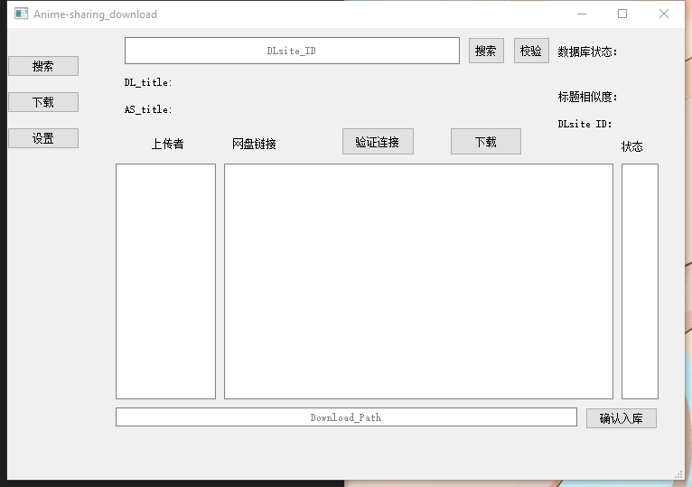
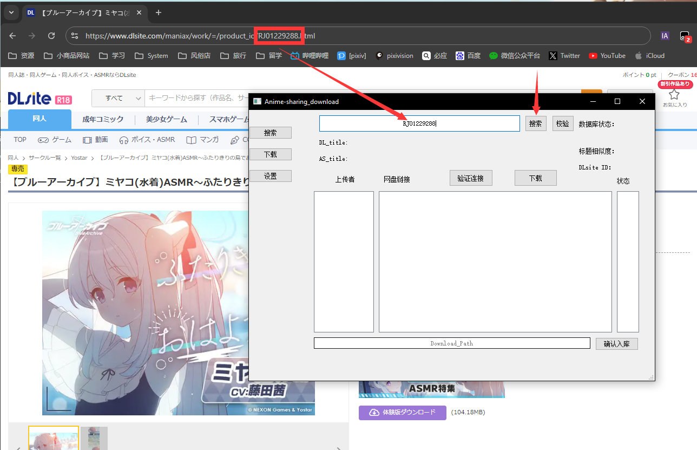
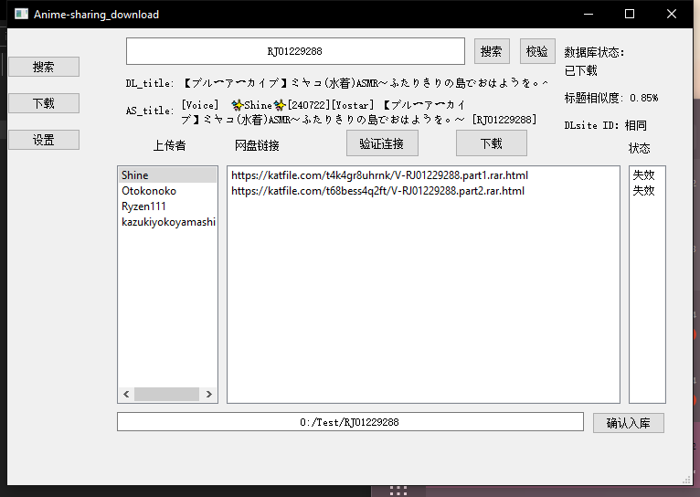

##  本程序可用于在Anime-sharing中检索查找DLsite作品 

数据库采用mysql数据库，用于方便管理已下载作品。也有非数据库模式。

``` ini
[database]
open_db = True
# 没有MySQL数据库 请将其设置为False 否则程序可能无法启动

[start_type]
type = GUI
# 有两种模式CLI与GUI模式 不建议使用CLI模式（使用CLI必须有数据库，并且CLI是爬虫模式）

[Proxy]
openproxy = True 
host = 127.0.0.1
port = 10809
type = http
# 这些配置项可以在UI中设置页面中修改

[katfile]
ifkatfiledown = True
user = user
passwd = passwd
xfss = xfss
# xfss 目前由于CF的限制 需要自己在网页登录后 点击F12 中获取

[LogLevel]
level = error
# error info warning 三种等级 不建议修改
```


### 基本窗口




 

``` tex
按钮说明
搜索 - 仅可搜索DLsite中的RJ号 (目前仅支持RJ VJ|BJ未支持)
校验 - 用于下载错误的连接进行重新搜索下载链接
验证连接 - 用于验证连接有效性（有部分下载连接会失效）

```


### 使用说明



``` tex
比如 需要检索这个作品下载 
将RJ号复制到此处 点击搜索 
```



 ``` tex
 点击搜索 因为该作品我已经下载并且入库 所以数据库状态会显示‘已下载’
 如果是开启了数据库模式 点击搜索：已经入库的作品将只显示 已下载 其他不在显示 如果需要下载失败需要重新下载 则点击校验即可
 
 上传者一列 点击其中一个之后 则显示出中间列表的下载连接（目前仅支持katfile 因为中国大陆可以直连下载）
 如果part过多 担心一个个点击下载后遇到失效文件 可以线点击验证链接 连接状态会在状态列中显示
 
 只需要单击中间连接列表即可调用默认浏览器进行下载（在windows下生效 其它系统未知）
 当下载完成后 ，可以点击确认入库（使用数据库模式情况下）
 ```

